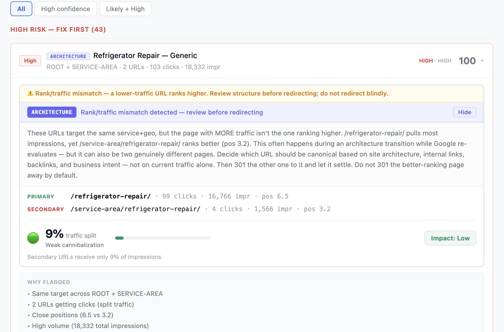
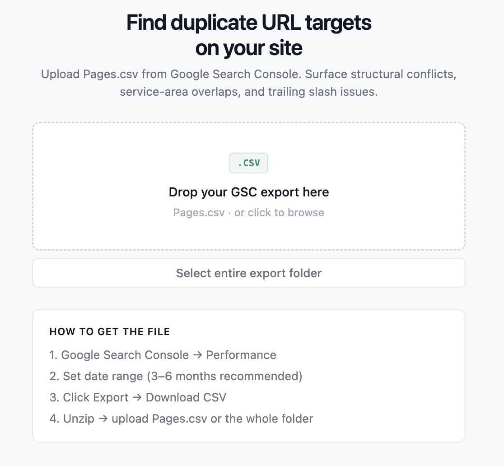

# CanniScope 🔎

**A free, browser-based keyword-cannibalization auditor for local SEO.**

Drop in your Google Search Console `Pages.csv` export and CanniScope surfaces where multiple pages are competing for the same service + geo — structural conflicts, service-area overlaps, and trailing-slash duplicates — then ranks each cluster by risk and tells you what to do about it (merge, 301, canonical, or leave alone).

👉 **Live app: [canniscope.vercel.app](https://canniscope.vercel.app)** — no signup, completely free.



---

## Why it exists

On multi-location service sites (appliance repair, HVAC, plumbing, cleaning…) it's easy to end up with `/services/refrigerator-repair`, `/locations/austin/refrigerator-repair`, and `/service-area/austin` all chasing the same query. Google splits the ranking signal between them and none of them win. Finding these by hand across hundreds of URLs is miserable.

CanniScope reads your real GSC performance data and does it in seconds.

## 🔒 Your data never leaves your browser

CanniScope is a **100% client-side** app. Your files are parsed in-browser with [PapaParse](https://www.papaparse.com/) — nothing is uploaded to any server, there is no backend, and no data is stored. You can even run it fully offline after the page loads.

## What it does

- **Reads GSC `Pages.csv`** (Performance → Pages export) directly in the browser.
- **Query overlap mode** — give it a query + page CSV and it shows which of your pages actually get impressions for the same searches, how many impressions are contested, and whether to merge, retarget or leave the pair alone. Brand searches, homepage overlaps and generic searches that Google splits by city ("ice maker repair" on a Dallas page and a Houston page) are left out.
- **Knows what you already fixed** — add a redirect / 404 list and those URLs drop out before the scan; clusters they used to cause are counted as resolved instead of reported. GSC keeps showing redirected URLs for months, so without this list a lot of the output is old news.
- **Detects same-target URLs** — groups pages that target the same service + location, using slug tokenization at word boundaries (not naive substring matching). `dallas-ga` and `dallas-tx` never share a cluster; a match that only works after dropping a state or a "city" suffix is shown for manual review, never as a redirect.
- **Filters out false positives** — brand pages (Sub-Zero, LG…), symptom pages (`not-cooling`), modifier pages (`cost`, `near-me`), content/blog and informational pages are recognized and *not* flagged against plain service pages.
- **Risk-ranks every cluster** — High / Medium / Low, plus a separate bucket for technical duplicates (trailing slash, etc.).
- **Picks the primary URL by real GSC data** (clicks + impressions) and gives a plain-English recommendation: merge & 301, set canonical, or review intent first.
- **"Start here" priority list** and a **"Why NOT flagged"** breakdown so you can trust the output.
- **Export** the full report or a CSV, or copy to clipboard.

## How to use



1. In **Google Search Console → Performance → Pages**, set your date range and **Export → CSV**.
2. *(Recommended)* Get a **query + page CSV** — columns `query, page, clicks, impressions, position`. GSC's own export can't pair queries with pages; use the Search Console API, Looker Studio or the Search Analytics for Sheets add-on.
3. *(Recommended)* Get a **redirect / 404 list** — GSC → Indexing → Pages → "Page with redirect" and "Not found (404)" → Export (drop the whole unzipped folder), or a Screaming Frog export with a `Status Code` column.
4. Open **[canniscope.vercel.app](https://canniscope.vercel.app)** and drop all files at once. Files are recognized by their columns, not by name.
5. Review the clusters, starting with **Competing for the same searches**. Always sanity-check before making any redirect.

> ⚠️ **Experimental beta.** CanniScope can produce false positives. It's a triage tool to point you at likely problems — always review a cluster manually before merging or redirecting anything.

## Run locally

```bash
git clone https://github.com/IgorOdaryuk/Canniscope.git
cd Canniscope
npm install
npm run dev
```

Built with **React + Vite**. Build for production with `npm run build`. Run the regression tests with `npm test`.

## Adapting it to your niche

The default token dictionaries are tuned for **home-service / appliance-repair** sites. To adapt CanniScope to a different vertical, edit the token sets near the top of [`src/lib/analyze.js`](src/lib/analyze.js):

- `BRAND_TOKENS` — brand names that signal a different intent
- `SYMPTOM_PATTERNS` / `SYMPTOM_SINGLE` — problem/symptom keywords
- `MODIFIER_TOKENS` — commercial modifiers (`cost`, `best`, `near-me`…)
- `CONTENT_TOKENS` — blog/guide keywords
- `INFORMATIONAL_TOKENS` — non-service pages to always skip
- `getSection()` — maps your URL structure (`/services/`, `/locations/`…) to sections

Making these configurable from the UI is a great **first contribution** — see below.

## Contributing

PRs welcome — especially:
- Making the token dictionaries configurable (per-niche presets or a settings panel).
- Support for other CSV shapes / SEO tools beyond GSC.
- Better clustering heuristics and fewer false positives.

Open an issue or a pull request. If you use CanniScope on a real site, I'd love to hear what it caught.

## License

[MIT](LICENSE) — free to use, modify, and build on.

---

Built by **[Igor Odariuk](https://odariuk.com)** — local SEO & technical SEO.
Fighting keyword cannibalization on your site and want a hand fixing it? **[Get in touch → odariuk.com](https://odariuk.com)**
